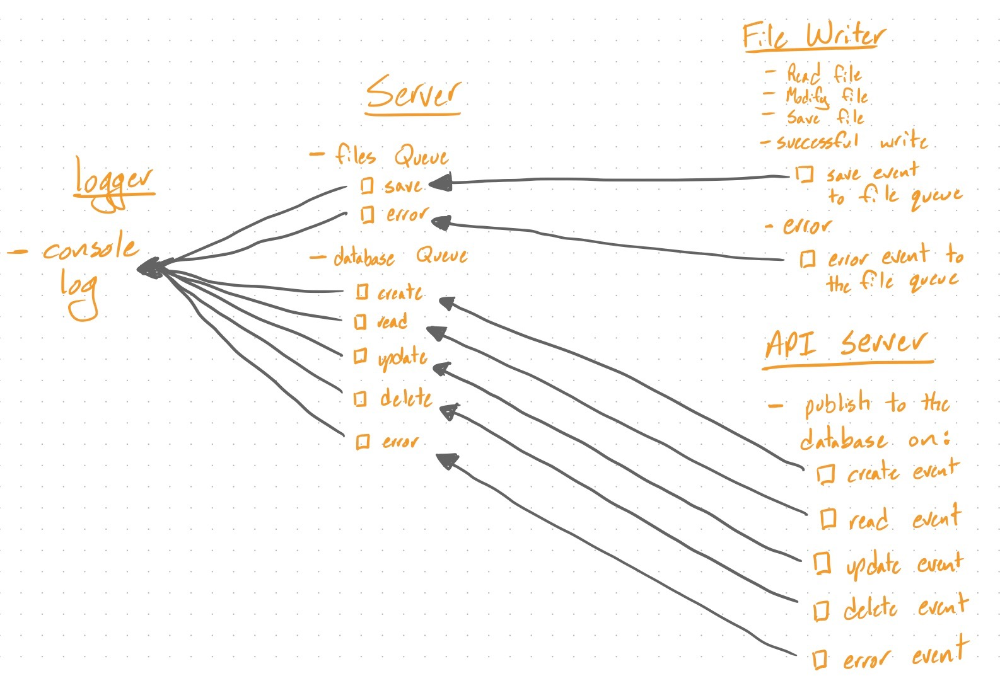

#  LAB 19

## API Server
### Author: Jagdeep Singh

Provided a partially working API server, lab is 
to complete the server's functionality by creating 
the data models and writing a full test suite.

### Links and Resources
* [submission PR]()
* [travis]()

#### Documentation
* [api docs](http://xyz.com) (API servers)
* [jsdoc](http://xyz.com) (Server assignments)

### Setup
#### `.env` requirements
* `PORT` - Port Number
* `MONGODB_URI` - URL to the running mongo instance/db
* `QUEUE_SERVER` - Full URL and PORT of your running queue server

#### Running the app
* `npm start`

  
#### Tests
* How do you run tests?

  `npm test`

<!-- * What assertions were made?
* What assertions need to be / should be made? -->

#### UML

